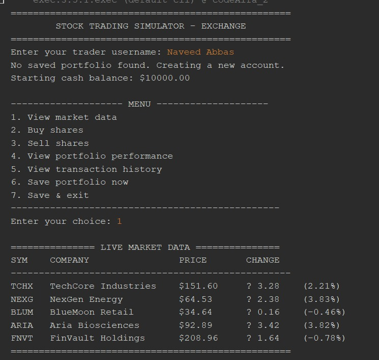
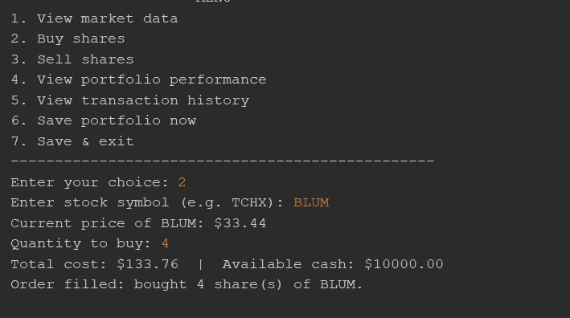
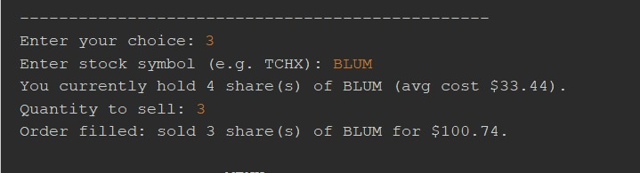
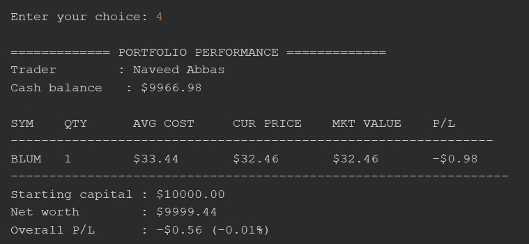
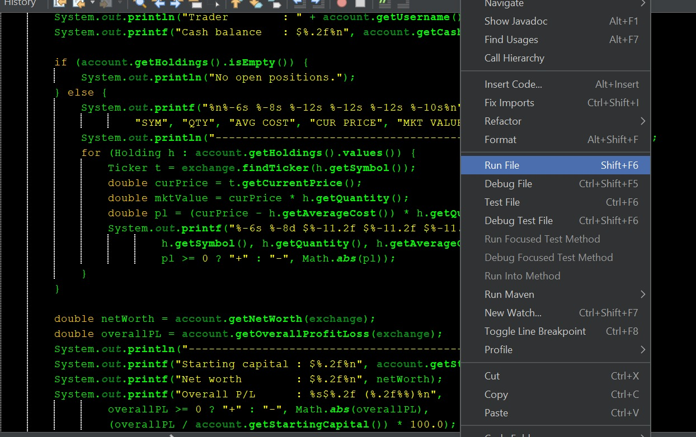

# 📈 Stock Trading Platform

A Java-based **Stock Trading Platform** developed as part of CodeAlfa Task 2.

This project simulates a basic stock trading environment where users can view market data, buy and sell stocks, and track their portfolio performance.

## 📌 Task Requirements

* Simulate a basic stock trading environment
* Display market data
* Perform buy and sell operations
* Track portfolio performance
* Use Object-Oriented Programming (OOP)
* Manage stocks, users, and transactions
* Optionally use file I/O or a database for data persistence

## 🛠️ Technologies Used

* **Java**
* **Object-Oriented Programming (OOP)**
* **Arrays / ArrayLists**
* **Console Interface**
* **File I/O** *(if implemented)*

## ✨ Features

### 📊 Market Data

Users can view available stocks along with their current prices.

### 💰 Buy Stocks

Users can purchase stocks by selecting a stock and specifying the quantity.

### 💸 Sell Stocks

Users can sell stocks they own from their portfolio.

### 👤 User Management

The system manages users and their account information.

### 📁 Portfolio Management

Users can view their current stock holdings and portfolio value.

### 📈 Performance Tracking

The platform calculates and displays portfolio performance based on stock prices and transactions.

### 🔄 Transaction Management

Buy and sell operations are recorded as transactions.

## 🧱 OOP Design

The project uses Object-Oriented Programming to organize the application.

Example classes include:

```text
Stock
User
Transaction
Portfolio
TradingPlatform
```

Each class is responsible for a specific part of the trading system.

## 📂 Project Structure

```text
stock-trading-platform/
│
├── images/
│   ├── image1.jpeg
│   ├── image2.jpeg
│   └── image3.jpeg
│
├── codeAlfa task 2.txt
└── README.md
```

## 🖥️ Program Screenshots

### Screenshot 1



### Screenshot 2



### Screenshot 3



### Screenshot 4



### Screenshot 5




## ▶️ How to Run

Make sure Java is installed on your system.

Compile the Java program:

```bash
javac "codeAlfa task 2.java"
```

Run the program:

```bash
java "codeAlfa task 2"
```

> Replace the filename with the actual name of your Java source file if it is different.

## 🎯 Learning Objectives

This project demonstrates practical use of:

* Classes and objects
* Encapsulation
* Constructors
* Methods
* ArrayLists
* Inheritance and polymorphism where applicable
* User input
* Conditional statements
* Loops
* File handling
* Basic financial calculations
* Transaction management

## 🚀 Future Improvements

Possible improvements include:

* Real-time stock market API integration
* Database support
* User authentication
* Graphical User Interface (GUI)
* Transaction history
* Advanced portfolio analytics
* Persistent user portfolios
* Stock price charts

## 👨‍💻 Author

**Farhan Ali**

## 📜 Task

**CodeAlfa – Task 2: Stock Trading Platform**
